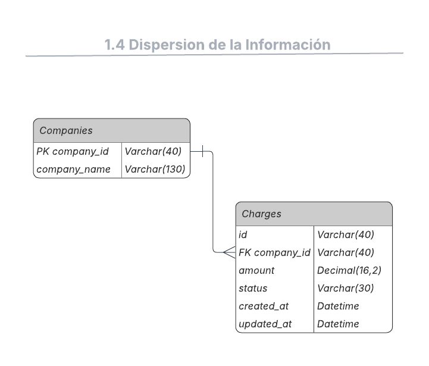
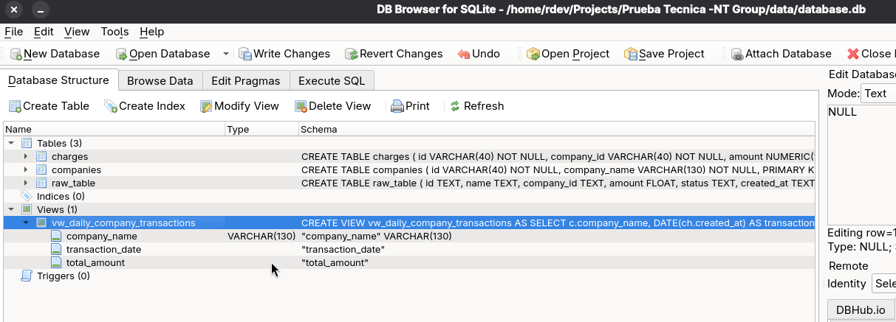

# Prueba Técnica - NT Group

## Descripción
Pipeline ETL para procesamiento de transacciones financieras, con normalización de datos, carga a base de datos relacional y generación de vistas analíticas.

## Herramientas Utilizadas
- **Python:** Lenguaje principal.
- **Pandas:** Para la manipulación y transformación de datos.
- **SQLAlchemy:** Como ORM para la interacción con la base de datos.
- **SQLite:** Motor de base de datos elegido para esta prueba.
- **DB Browser for SQLite:** Herramienta visual utilizada para la validación de esquemas, ejecución de queries de prueba y verificación de la integridad de los datos cargados.
- **uv:** Gestor de paquetes ultrarrápido escrito en Rust (ver sección de instalación).

## Análisis Inicial y Transformación (Google Colab)
*Nota sobre el proceso inicial:* La exploración inicial de los datos y las primeras pruebas de limpieza y transformación se realizaron utilizando Google Colab. Esto permitió iterar rápidamente sobre el conjunto de datos crudo antes de consolidar el script final en Python (`src/etl/transform.py`).

[Ver análisis inicial en Google Colab](https://colab.research.google.com/drive/1JYx5WRJYXqHjDh2fZrWXKg5BX3dHMhs5?usp=sharing)

## Arquitectura de la Base de Datos
La prueba tecnica divide la información cruda en dos tablas principales relacionadas, teniendo en cuenta que una compañia tiene muchos cargos. Una realcion de uno a mcuhos. Normalizando así los datos:
1.  **Companies:** Almacena la información de las compañías.
2.  **Charges:** Almacena las transacciones, enlazadas a una compañía.






## Estructura del Proyecto
El proyecto se organiza modularmente:

```
.
├── data/ 
│   ├── data_prueba_tecnica.csv # Dataset inicial de la prueba.
│   └── processed/ # Archivos intermedios del ETL.
├── docs/ 
│   └── diagrama_db_prueba.png # Diagrama de la base de datos.
├── src/ 
│   ├── database/ # creación de vista.
│   │   └── view.sql 
│   ├── etl/ # Componentes ETL.
│   │   ├── extractor.py # Extrae datos de la fuente.
│   │   ├── loader.py # Carga datos iniciales en DB.
│   │   └── transform.py # Transforma y carga datos limpios.
│   ├── models/ # Definiciones de modelos de DB con SQLAlchemy.
│   │   └── models.py # Modelos para tablas Companies y Charges.
│   ├── database_config.py # Configuración general de la base de datos.
│   └── main.py # Orquestador principal del proceso ETL.
├── .gitignore
├── pyproject.toml # Configuración de dependencias con uv.
├── README.md 
├── requirements.txt # Lista de dependencias para pip.
└── uv.lock 
```

## Instalación y Configuración

### Uso de `uv` (Recomendado)
Este proyecto utiliza [uv](https://github.com/astral-sh/uv), un gestor de paquetes y resolutor de dependencias de Python extremadamente rápido. Si no tienes `uv` instalado, puedes instalarlo con:
```bash
curl -LsSf https://astral.sh/uv/install.sh | sh
```
*(O visita la documentación oficial de `uv` para otras opciones).*

Para sincronizar el entorno y las dependencias utilizando el archivo `uv.lock`:
```bash
uv sync
```
### Alternativa con `requirements.txt`
Si prefieres usar `pip` tradicional con un entorno virtual clásico:
```bash
# Crear entorno virtual
python -m venv .venv
source .venv/bin/activate  # En Windows: .venv\Scripts\activate

# Instalar dependencias
pip install -r requirements.txt
```

## Ejecución del Proyecto

### 1. Pipeline ETL y Base de Datos
Para ejecutar el flujo completo que carga el CSV, extrae, transforma, y carga los datos en la base de datos SQLite:
```bash
uv run src/main.py
```
*(O `python src/main.py` si usaste el método tradicional).*

## Decisiones Técnicas y Retos

### SQLAlchemy
La eleccion de sqlalchemy basicamente se debe a la cantidad de herramientas que nos provee para moldear bases de datos y fabricar una conexion a cualquier tipo de base de datos sin modificar el codigo, es independiente y al final nos permitiria cambiar a una base de datos en Postgres por ejemplo. 

### SQLite como base de datos local
*Realmente se planeo usar una base de datos relacional porque es mas estrucurada de acuerdo a los datos que tenemos, de igual forma en base en mi experiencia es lo mas entendible*
Se decidio tomar como base de datos SQLite por su facilidad uso y rapido desarrollo con ella, teniendo en cuenta sus limitaciones desde el inicio. Se considero usar Postgres o MySQL (Gracias a SQLAlchemy es posible hacer el cambio) pero seria instalar el servicio necesario y levantarlo asi como tambien crear un docker para que sea replicable. 

Una limitacion de SQLite son los tipos de datos que permite y como los sobreescribe. Columnas como created_at o updated_at que son de tipo timestamp o date basicamente, en SQLite unicamente se escriben como una cadena de texto con un formato similar a "01-01-2000:00:00:00" incluso agregando Horas. Como tal sqlite no contiene el tipo de dato date. 

### Pandas
Se eligio pandas desde el inicio para realizar las transformaciones necesarias, como los cambios de tipo y principalmente para la inspeccion del data set  y la division del mismo. Un reto importante fue usar la liberia  para hacer las trasformaciones adecuadas. El principal reto consistió en optimizar el parseo de tipos de datos complejos y la gestión de nulos para asegurar la integridad en la transición entre capas (CSV a Parquet).

### ¿CSV o Parquet?
Principalmente se eligio el formato parquet como archivo despues de la extraccion inicial, ya que nos brinda mejor calidad en los metadatos de las columnas como amount de tipo Decimal o flotante, created_at y updated_at de tipo datetime o timestamp.

### Extracción
La etapa de extracción se enfoca en recuperar los datos crudos desde la base de datos de origen (SQLite en este caso) utilizando Pandas. El objetivo es obtener la información en un formato que cumpla con con el tipo de dato que corresponde a la informacion que contiene. Incluso desde esta paso se realizo la normalización de datos correctos para poder ser creados a parquet mediante pandas

### Transformación
La fase de transformación es crucial para limpiar, validar y reestructurar los datos extraídos.  la gestión de valores nulos (NaN/NaT), y la normalización de la información en las entidades `Companies` y `Charges` conforme al esquema final de la base de datos. Este proceso asegura la integridad y consistencia de los datos antes de su carga final.

Durante el análisis se detectó un registro con el identificador "*******". Se tomó la decisión técnica de no transformar este valor para mantener la fidelidad absoluta de la fuente original.

### Conclusión Importante
El sistema fue diseñado para ser agnóstico a la base de datos. Gracias a que existe un proceso de normalización y limpieza en la capa intermedia del pipeline, es posible migrar de SQLite a motores más robustos como PostgreSQL o MySQL con cambios mínimos en la configuración, manteniendo siempre la integridad de la información procesada.

### Nota final
Para este desafío, se decidió priorizar el ETL y Modelado SQL. El enfoque fue garantizar un sistema robusto, escalable y con una arquitectura limpia en el procesamiento de datos. Con la idea final de iterar.

